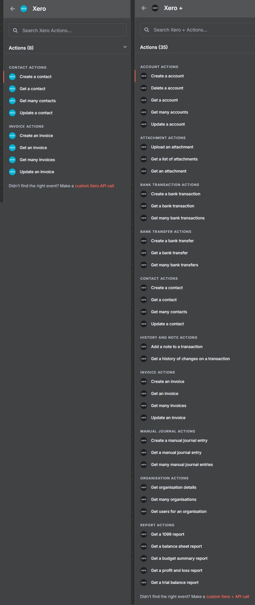

# n8n-nodes-xero-extended

An enhanced Xero integration for n8n that extends the standard Xero node with additional resources and improved functionality.

Xero Extended is an enhanced Xero integration that extends the standard Xero node with additional resources and improved functionality, including enhanced search capabilities, summary modes, and quality-of-life improvements.

[n8n](https://n8n.io/) is a [fair-code licensed](https://docs.n8n.io/reference/license/) workflow automation platform.

- [Installation](#installation)
- [Operations](#operations)
- [Credentials](#credentials)
- [Compatibility](#compatibility)
- [Resources](#resources)
- [Setup after installation](#setup-after-installation)
- [License](#license)
- [Support](#support)
- [Acknowledgments](#acknowledgments)  

## Installation

Follow the [installation guide](https://docs.n8n.io/integrations/community-nodes/installation/) in the n8n community nodes documentation.

**Note:** This node is currently only available for self-hosted n8n instances. It will be available for n8n Cloud users in the future via pull requests to the base Xero node.

## Operations

This node provides enhanced functionality for Xero integration, including additional resources and quality-of-life improvements that go beyond the standard Xero node.

### Available Operations

- **Contacts**: Get, Get Many, Create, Update, Delete
- **Invoices**: Get, Get Many, Create, Update, Delete
- **Organisations**: Get Connected Organisations, Get Organisation Details
- **Attachments**: Upload, Get, Get Many
- **Accounts**: Create, Get, Get Many, Update, Delete
- **Reports**: Get 1099 Report, Get Balance Sheet Report, Get Budget Summary Report, Get Profit and Loss Report
- **Bank Transactions**: Create, Get, Get Many
- **Bank Transfers**: Create, Get, Get Many
- **Manual Journals**: Create, Get, Get Many
- **History and Notes**: Create Note, Get History

Users can also benefit from the increased scopes to perform custom API calls with expanded actions.

## Credentials

This node uses Xero OAuth2 credentials that are separate from the standard Xero node. The credentials request additional scopes not included in the original Xero base node.

### Required Scopes

**Base scopes:**
- `offline_access`
- `accounting.transactions`
- `accounting.settings`
- `accounting.contacts`

**Additional scopes:**
- `accounting.attachments`
- `accounting.budgets.read`
- `files`
- `accounting.reports.read`

### Setup

1. Create a new Xero OAuth2 credential (cannot use the base Xero node credentials)
2. Select the resource/organizations you want to work with or accept all

## Compatibility

This node is compatible with n8n versions that support community nodes. Tested with recent n8n versions.

## Resources

### 📞 Contacts
Enhanced contact management with improved search and performance options:

- **Get Contact** - Retrieve a single contact with optional summary mode
- **Get Many Contacts** - Retrieve multiple contacts with enhanced search capabilities
- **Create Contact** - Create new contacts
- **Update Contact** - Update existing contacts
- **Delete Contact** - Remove contacts

**Improvements:**
- ✅ **Summary Only Option** - Returns lightweight responses for faster execution
- ✅ **Enhanced Search** - Case-insensitive text search across Name, FirstName, LastName, ContactNumber, CompanyNumber, and EmailAddress fields

### 🧾 Invoices
Comprehensive invoice management with enhanced functionality:

- **Get Invoice** - Retrieve a single invoice with optional summary mode
- **Get Many Invoices** - Retrieve multiple invoices with search capabilities
- **Create Invoice** - Create new invoices
- **Update Invoice** - Update existing invoices
- **Delete Invoice** - Remove invoices

**Improvements:**
- ✅ **Summary Only Option** - Returns lightweight responses for faster execution
- ✅ **Enhanced Search** - Case-insensitive text search across invoice fields
- ✅ **Contact Selection** - Dropdown to select contacts by name with fallback to ContactID via expression

### 🏢 Organisations
Manage organization information and connections:

- **Get Connected Organisations** - Retrieve list of connected organizations
- **Get Organisation Details** - Get detailed organization information

### 📎 Attachments
Complete attachment management for all transaction types:

- **Upload Attachment** - Upload files to any transaction (Invoices, Bills, Bank Transactions, etc.)
- **Get Attachments** - Retrieve list of attachments for a transaction
- **Get Attachment** - Download specific attachment files

### 💰 Accounts
Full account management capabilities:

- **Create Account** - Create new chart of accounts entries
- **Get Account** - Retrieve specific account details
- **Get Many Accounts** - Retrieve multiple accounts with filtering
- **Update Account** - Modify existing accounts
- **Delete Account** - Remove accounts

**Quality of Life Improvements:**
- ✅ **Enhanced Filtering** - Click-and-select filters for easier "Get All" result filtering

### 📊 Reports
Comprehensive reporting capabilities:

- **Get 1099 Report** - Retrieve 1099 tax reports
- **Get Balance Sheet Report** - Access balance sheet data
- **Get Budget Summary Report** - Retrieve budget information
- **Get Profit and Loss Report** - Access P&L statements

**Quality of Life Improvements:**
- ✅ **User-Friendly Formatting** - Compact, readable format for Balance Sheet, Budget Summary, Profit and Loss, and Trial Balance reports

### 🏦 Bank Transactions
Complete bank transaction management:

- **Create Bank Transaction** - Create new bank transactions
- **Get Bank Transactions** - Retrieve transaction history
- **Get Many Transactions** - Retrieve multiple transactions with filtering

### 💸 Bank Transfers
Manage bank transfers between accounts:

- **Create Bank Transfer** - Create transfers between bank accounts
- **Get Bank Transfers** - Retrieve transfer history
- **Get Many Transactions** - Retrieve multiple transfers with filtering

### Manual Journals
Manage manual journal entries:

- **Create Manual Journal** - Create new manual journal entries
- **Get Manual Journal** - Retrieve specific manual journal details
- **Get Many Manual Journals** - Retrieve multiple manual journals with filtering

### 📝 History and Notes
Track changes and manage notes:

- **Create Note** - Add new notes
- **Get History** - Retrieve transaction history

## Installation

### For n8n Cloud users

This node is currently only available via installation on self-hosted instances. I will push to n8n-cloud via pull requests down the line to the base Xero node. However, so many changes and revisions have been done that the process would be time consuming for individual pull requests for the team to approve. I'll try to get to this some time in following month once I see about more additions.

### For self-hosted n8n users

To install a custom node in n8n, follow these steps:

- Refer to the official documentation: n8n Custom Node Installation (https://docs.n8n.io/integrations/community-nodes/installation/)
- Choose the custom node you want to install, on the install community nodes box you'll enter the npm package name for the node. For example, n8n-nodes-xero-extended
- Once installed you will now need to setup the credentials for the node. See below for more info.

## Setup after installation

Similar to base Xero node:
1. Once installed you will set up the credentials in the same way done for the Xero base node. (you can't use the base Xero node as additional scopes are requested and needed for this node)
2. Select the resource/organisations you want to work with or accept all

## Credentials

This node uses a separate set of Xero OAuth2 credentials from the standard Xero node. The credentials created will also request additional scopes not in the original Xero base node. The scopes requested are as follows:

Previously the only scopes requested were: 	'offline_access', 'accounting.transactions', 'accounting.settings',	'accounting.contacts'

Now the following are requested in addition: 	'accounting.attachments',	'accounting.budgets.read',	'files',	'accounting.reports.read',

## License

[MIT](LICENSE)

## Support

For support, please open an issue on the [GitHub repository](https://github.com/Mad-Man-Dan/n8n-nodes-xero-extended).

## Acknowledgments

This node is built upon the official n8n Xero node. Special thanks to:

- **n8n team** - For the original Xero node implementation
- **Xero API team** - For providing the excellent API
- **n8n community** - For the supportive ecosystem

### Original Work Attribution

This project extends the functionality of the official n8n Xero node, which is part of the n8n core project. The original Xero node is licensed under the MIT License and is maintained by the n8n team.

- Original Xero node: [n8n-nodes-base.xero](https://docs.n8n.io/integrations/builtin/app-nodes/n8n-nodes-base.xero/)
- n8n project: [https://n8n.io](https://n8n.io)

For detailed attribution information, see [ACKNOWLEDGMENTS.md](ACKNOWLEDGMENTS.md).

## Author

**Daniel Fonseca** - [daniel@appvisory.dev](mailto:daniel@appvisory.dev)

---

Built for the n8n community and shout out to AutomationTown
